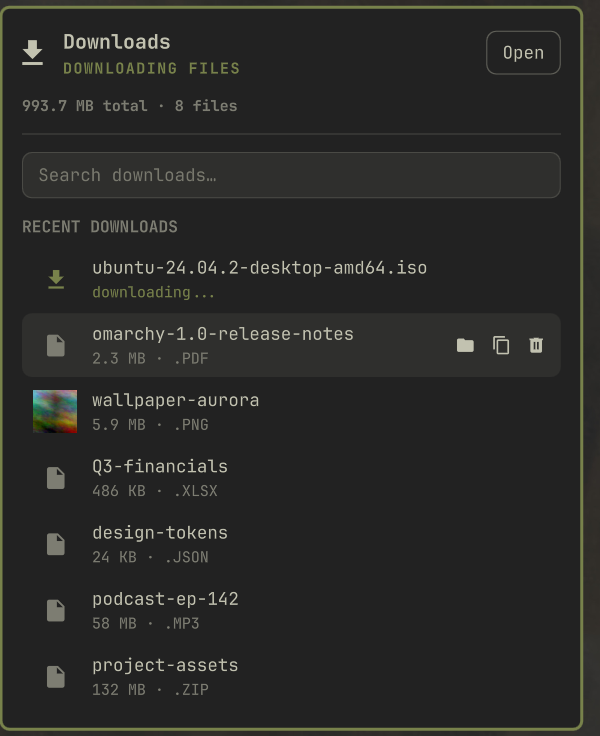

# Omarchy Downloads

Your Downloads folder, one click away. A bar widget for [Omarchy](https://omarchy.org) that shows your most recent downloads with live tracking, instant search, and quick actions — without opening a file manager.



## Features

- **Recent downloads at a glance** — the newest files in your Downloads folder, with size and type.
- **Live tracking** — new files appear instantly; in-progress downloads (`.part`, `.crdownload`, `.download`) show as downloading while the bar icon pulses, and it gets a badge when one finishes while the panel is closed.
- **Stalled downloads surfaced** — when a download dies partway through (browser crash, dropped connection), its row stops claiming to be in progress and is marked *Stalled — download incomplete*, so you can reveal or trash the leftover file instead of watching it spin forever.
- **Search everything** — type to filter the *entire* folder, not just the recent list. Enter opens the top match.
- **Quick actions** on any finished file: open (default app), reveal in file manager, copy to clipboard (paste into any file manager or chat), move to trash (with confirmation). Files still downloading stay non-actionable, so you can't open or copy a half-written one by accident.
- **Folder totals** — total size and file count in the header, plus a button to open the folder.
- **100% local** — no network access, no sudo, no bundled binaries. Just QML and a few tiny shell helpers (`wl-copy`, `gio`, `xdg-open`, `stat` — all part of a standard Omarchy install).

## Install

```bash
omarchy plugin add https://github.com/roymelgarv/omarchy-downloads --enable
```

Then place the widget where you want it:

```bash
omarchy bar move roymelgarv.omarchy-downloads --section right
```

### Optional keybinding

Plugins can't ship keybindings, but one line in `~/.config/hypr/bindings.conf` summons the panel from the keyboard:

```conf
bind = SUPER, D, exec, omarchy-shell downloads toggle
```

### Keyboard

The panel opens with the search field already focused, so you can start typing straight away.

| Key | Action |
|---|---|
| `↑` / `↓` | Move the selection |
| `Enter` | Open the selected file |
| `Delete` | Trash the selected file — only while the search box is empty, so it still forward-deletes as you type |
| `Shift`+`Delete` | Trash the selected file, even mid-search |
| `Esc` | Clear the search first, then close the panel |

## Configure

Right-click the widget (or use the bar settings UI) to change:

| Setting | Default | Description |
|---|---|---|
| Folder to watch | `~/Downloads` | Any folder works — it's just a folder widget at heart. |
| Recent files shown | 7 | List length when not searching (3–15). |
| Badge on new downloads | on | Dot on the bar icon when a download finishes while the panel is closed. |
| Confirm before trashing | on | Skip the confirmation dialog if you like to live dangerously (trash is still recoverable). |

## Update

```bash
omarchy plugin update roymelgarv.omarchy-downloads
```

## Remove

```bash
omarchy plugin remove roymelgarv.omarchy-downloads
```

## Development

See [CONTRIBUTING.md](CONTRIBUTING.md). Short version:

```bash
node --test tests/*.test.mjs   # unit tests
scripts/dev.sh                 # deploy to the live shell
scripts/dev.sh --restart       # deploy + restart the shell (required after Service.qml edits)
```

## License

[MIT](LICENSE)
